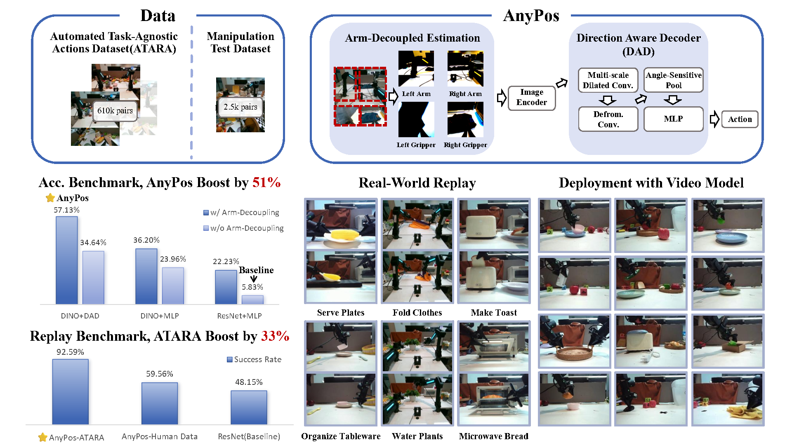

# Anypos: Automated Task-Agnostic Actions for Bimanual Manipulation

### 📝[Paper](https://www.arxiv.org/pdf/2507.12768) | 🌍[Project Page](https://embodiedfoundation.github.io/vidar_anypos) | 🤗[Huggingface](https://huggingface.co/embodiedfoundation/AnyPos)



AnyPos is a robot-specific image-to-action model **trained entirely on task-agnostic trajectories sampled by ATARA (Automated Task-AgnosticRandom Actions)**, a novel data collection framework that **automatically generates large-scale task-agnostic actions** for bimanual manipulation efficiently. It integrates two key techniques to enhance performance: **Arm-Decoupled Estimation** and **Direction-Aware Decoder (DAD)**. Together, ATARA and AnyPos constitute **a fully task-agnostic framework for training IDMs without goal supervision**. By combining scalable unsupervised data collection with physically informed learning architectures, our approach demonstrates that task-agnostic action data can serve as a practical and powerful foundation for generalizable manipulation.

We additionally integrate a video-conditioned action validation module to verify the feasibility of learned policies across diverse manipulation tasks, and we demonstrate that the AnyPos-ATARA pipeline yields a **51% improvement** in test accuracy and achieves **30-40% higher success rates** in downstream tasks such as lifting, pick-and-place, and clicking, using replay-based video validation.

## Installation Instructions
```bash
conda deactivate
conda create -n anypos python=3.10
conda activate anypos

pip install -e .
```

## Dataset

The task-agnostic action data sampled by ATARA can be downloaded from [HERE](https://huggingface.co/embodiedfoundation/ATARA)🤗, which consists of hundreds of trajectories. You should place the whole `atara` file in any directory and refer it in your training/inference scripts.

## Model

A trained model can be found in [HERE](https://huggingface.co/embodiedfoundation/AnyPos)🤗, whose type is `direction-aware_with_split`. You can test it on the testset given by ATARA dataset.

## Training IDM
To train IDM without arm-decoupling, run:
```bash
bash scripts/idm/train.sh
```
You need to replace the correct path to the training and test dataset in `scripts/idm/train.sh`, and assign a save path. The supported options for `model_name` are: `dino`, `direction-aware`, `resnet`.

To train IDM with arm-decoupling, run:
```bash
bash scripts/idm/train_split.sh
```
The supported options for `model_name` are: `dino_with_split`, `direction-aware_with_split`, `resnet_with_split`.

## Evaluation
To evaluate the trained IDM, run:
```bash
bash scripts/idm/eval.sh
```
You need to replace the correct path to the test dataset in `scripts/idm/eval.sh`, set the checkpoint, and assign a save path. The supported options for `model_name` are: `dino`, `direction-aware`, `resnet`. The code will additionally produce a visualization depicting the L1 error distribution for each qpos dimension.

## Citation

If you find our work useful for your project, please consider citing the following paper:

```bibtex
@misc{tan2025anyposautomatedtaskagnosticactions,
    title={AnyPos: Automated Task-Agnostic Actions for Bimanual Manipulation}, 
    author={Hengkai Tan and Yao Feng and Xinyi Mao and Shuhe Huang and Guodong Liu and Zhongkai Hao and Hang Su and Jun Zhu},
    year={2025},
    eprint={2507.12768},
    archivePrefix={arXiv},
    primaryClass={cs.CV},
    url={https://arxiv.org/abs/2507.12768}, 
}
```

Thank you!

## License
All the code, model weights, and data are licensed under [Mozilla Public License Version 2.0](./LICENSE).